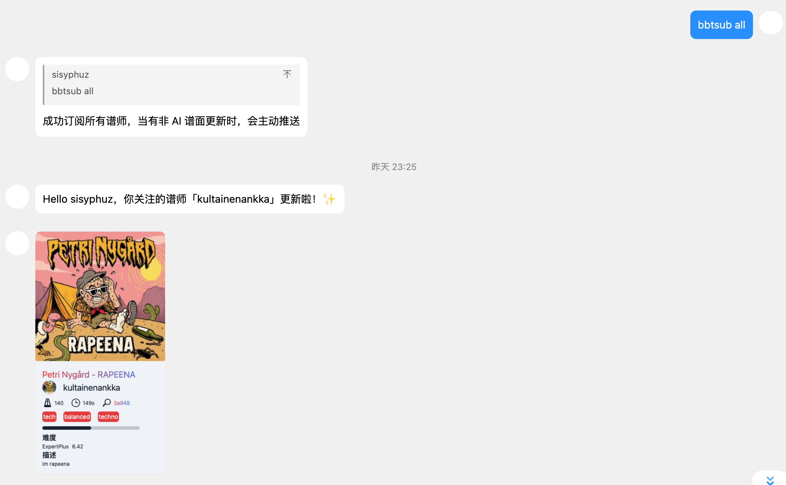

# map 相关指令

本节介绍的指令主要用途是查询 beatsaver 谱面并生成渲染图。

这涉及到三个指令，`bsbot.id` 和 `bsbot.new`, `bsbot.search`,`bsbot.subscribe`。

### bsbot.id

别名 `bbid`, `!bsr`

使用方式 `bbid [id]`

如 `bbid 3877a` 或 `bsbot.id 3877a` 或 `!bsr 3877a` 或 `3877a`

该指令会查询指定 id 的谱面，并生成渲染图，以及预览音频。

### bsbot.new

别名 `bbnew` `bblatest`

使用方式 `bbnew`

该指令会查询最新的三首谱面，并生成渲染图，以及预览音频。

### bsbot.search

别名 `bbsearch`,`bbsou`

使用方式 `bbsearch [keyword]`

如 `bbsearch 吉祥话`,`bbsearch megalovania`

该指令会根据关键词搜索，给出最相关的三首谱面，并生成渲染图，以及预览音频。

### bsbot.subscribe `实验性功能`

别名 `bbsub`

使用方式 `bbsub [mapper id]`

如 `bbsub 58338`

该指令会订阅指令中给出 id 对应的 beatsaver 谱师，当谱师有新的谱面更新时，会主动发送消息给订阅者。

::: info
通过 `bbsub all` 的方式可以订阅所有非 AI 谱面的更新，以 beatsaver 的更新频率来看，每天应该不到 30 个谱面。
:::

### bsbot.unsubscribe `实验性功能`

别名 `bbunsub`

使用方式 `bbunsub [mapper id]`

如 `bbunsub 58338`

该指令会取消订阅指令中所给出 id 对应的 beatsaver 谱师，当谱师更新时，不会再进行提醒。

