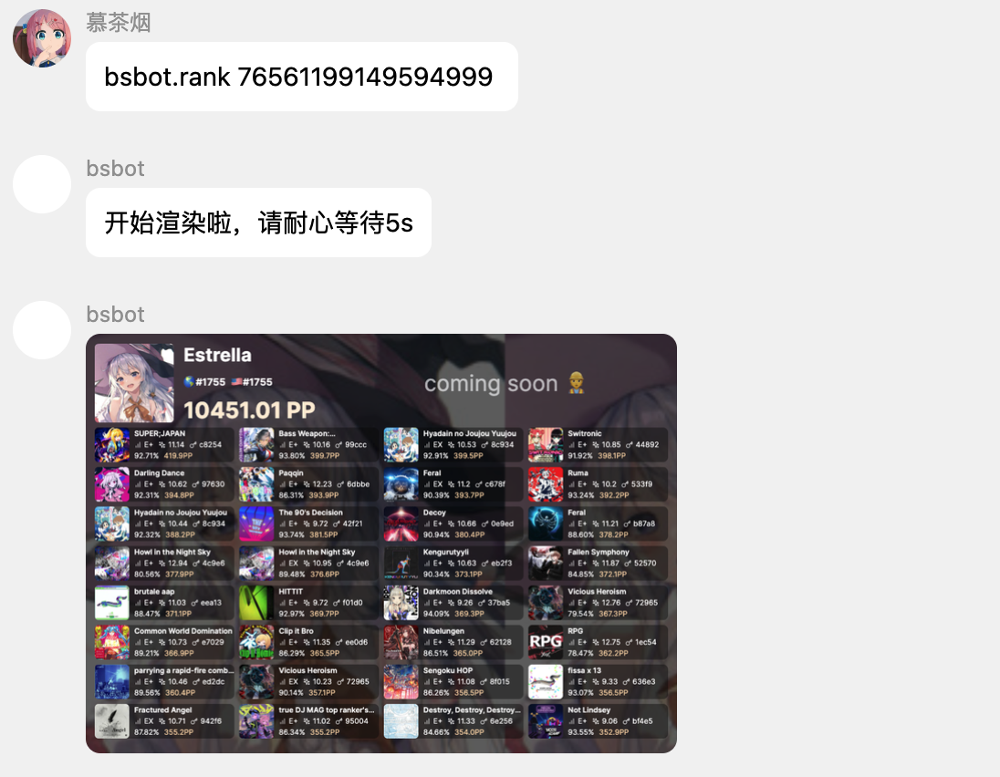
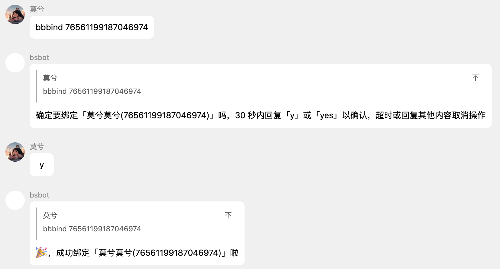
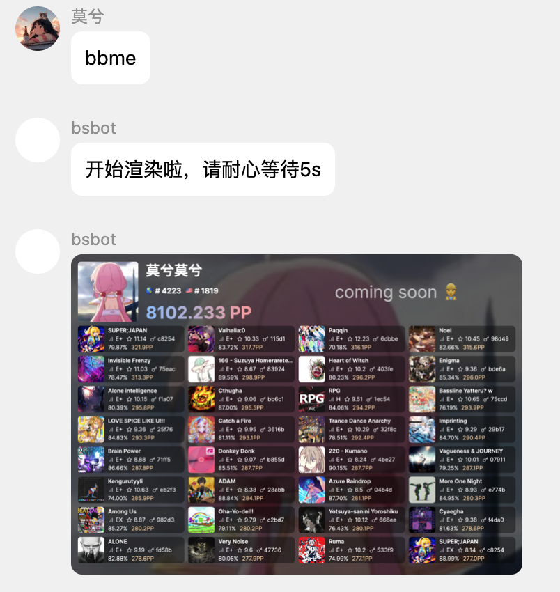
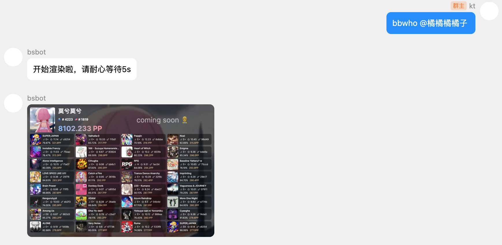

# rank 相关指令

本节介绍的指令主要用途是查询相关 beatleader/scoresaber 个人页面，生成渲染图。

这涉及到四个指令，`bsbot.rank`,`bsbot.bind` 和 `bsbot.me`, `bsbot.who`。

### bsbot.rank
别名 `bbrank`

使用方式:`bbrank [steam id]`

如：`bbrank 1922350521131465`

该指令会根据所给的 id 查询对应 beatleader/scoresaber 的数据，并给出渲染图。

::: tip
默认会从beatleader 获取数据，通过指定参数 platform，可以切换到 scoresaber 获取数据。

如 `bbrank -p ss 1922350521131465`
:::

### bsbot.bind
别名 `bbbind`

使用方式:`bbbind [steam id]`

如：`bbbind 1922350521131465`

简单来说，`bsbot.bind` 会将自己与所给的 steam id 进行绑定。
绑定成功后，通过调用 `bsbot.me`，可以查询对应 beatleader/scoresaber 的数据，并给出渲染图。

### bsbot.me
别名 `bbme`

使用方式:`bbme`

在通过 `bsbot.bind` 进行绑定操作之后才可正常使用。使用时会查询先前绑定的 steam id。
若 steam id 正确无误，会获取 beatleader/scoresaber 的个人页数据，并进行图片渲染，随后发送。

::: tip
与 bsbot.bind 类似，默认会从 beatleader 获取数据，通过指定参数 platform，可以切换到 scoresaber 获取数据。

如 `bbme -p ss`
:::

### bsbot.who

别名 `bbwho`

使用方式 `bbwho @someone`

若 @ 的用户先前进行过绑定，会查询该用户先前绑定的 steam id。
若 steam id 正确无误，会获取 beatleader/scoresaber 的个人页数据，并进行图片渲染，随后发送。

::: tip
与 bsbot.bind 类似，默认会从 beatleader 获取数据，通过指定参数 platform，可以切换到 scoresaber 获取数据。

如 `bbwho -p ss @someone`
:::

