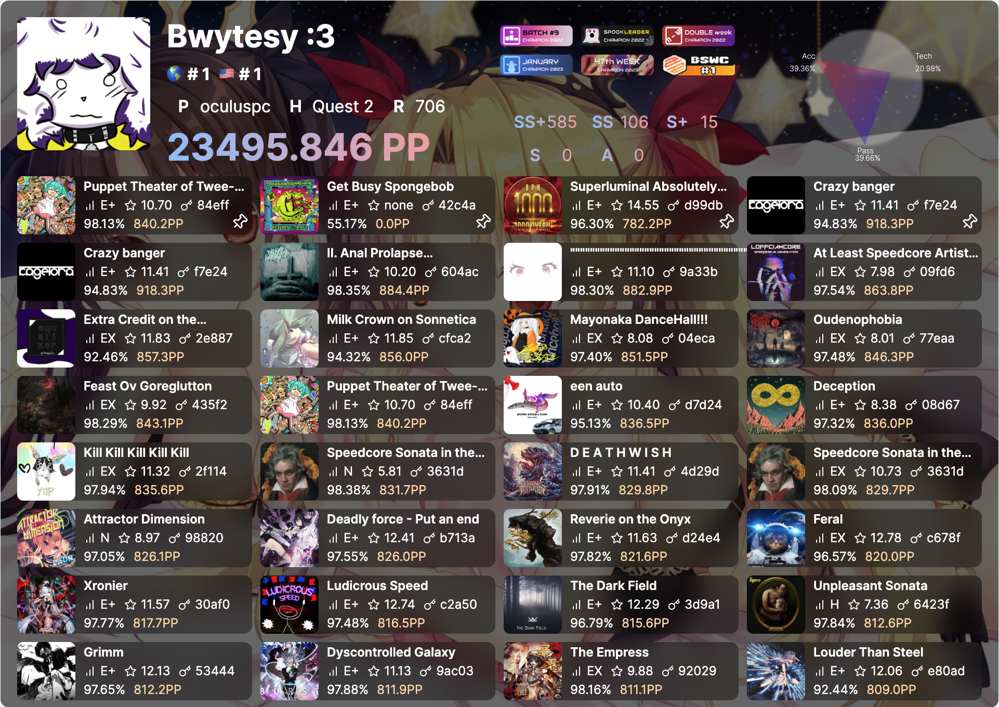
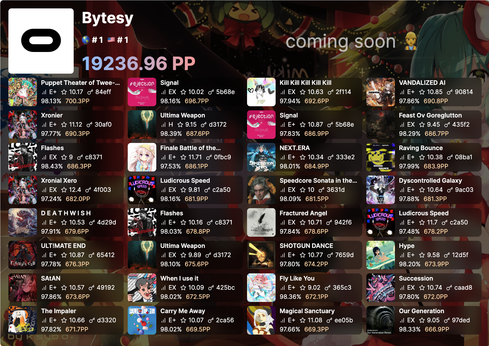
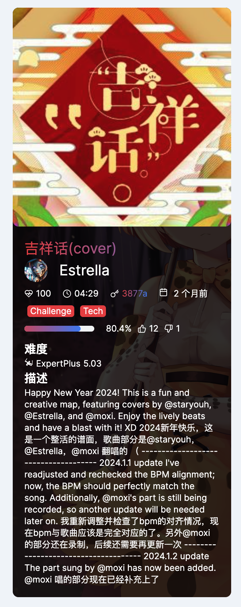

# Pic Examples

本节展示部分图片渲染效果图

::: info

本节相关渲染图均由 [bs-rank-render](https://github.com/ktKongTong/bs-rank-render) 给出。

通过此种方式，能够非常方便地更新渲染图效果。

rank 相关渲染图参考 [get-beastsaber-score](https://github.com/kkchara/get-beastsaber-score)。

非常感谢该项目给出的 well design。 为我节省了很多时间。
:::

### beatleader

### scoresaber

### 谱面

